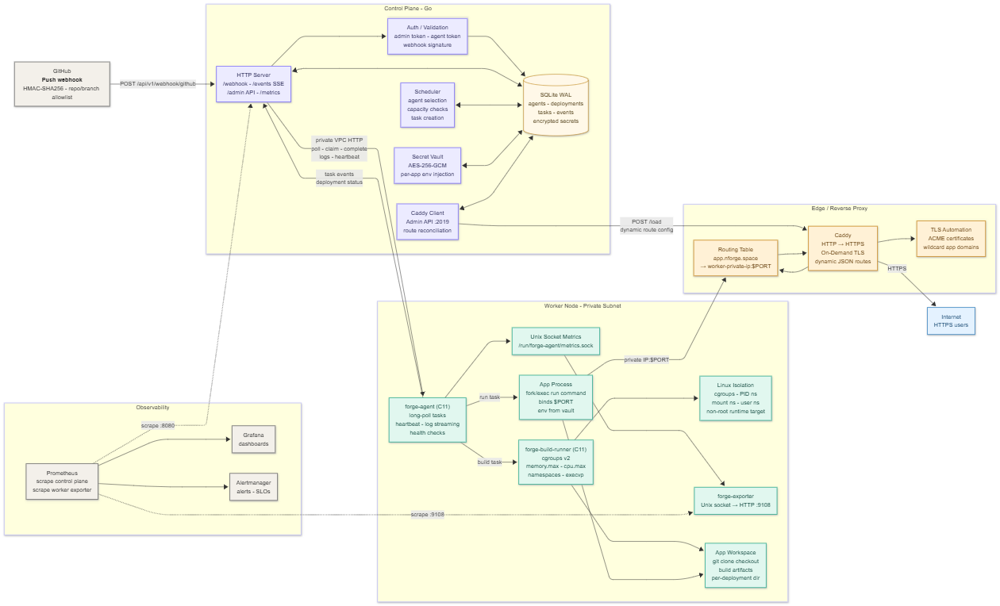

# Forge

Forge is a self-hosted deployment platform. You push a commit to GitHub, and Forge builds and runs your application on your own infrastructure - no third-party platform required.

Think of it as a stripped-down Render or Fly.io that you own entirely: one server runs the control plane, one or more servers run your apps, and a reverse proxy routes traffic automatically with TLS.

---

## How it works in plain terms

1. You add a `forge.yaml` file to your repository describing how to build and run your app.
2. You configure a GitHub webhook pointing to your Forge instance.
3. Every push to your allowed branch triggers a deployment:
   - Forge clones your repository.
   - Builds it using the commands you defined.
   - Starts the application process.
   - Runs health checks to confirm it is live.
   - Updates the reverse proxy so traffic reaches it at `your-app.yourdomain.com`.
4. Logs stream in real time. If the health checks fail, Forge marks the deployment failed, records retry state, and rolls back the route to the last healthy deployment when one exists.

Forge also exposes a public status page at `/`, a public aggregate status endpoint at `/api/v1/status`, and a reserved `admin` subdomain for the bundled admin console example in `examples/forge-admin`.

That is the entire lifecycle. No containers, no Kubernetes, no Docker daemon — just Linux processes, cgroups, and a Go binary orchestrating everything.

---

## Architecture

```
GitHub
  │  push webhook (HMAC-SHA256)
  ▼
┌─────────────────────────────────────────────────────────────────────┐
│  Control Plane  (Go)                                                │
│                                                                     │
│  ┌──────────────┐  ┌─────────────┐  ┌─────────────────────────┐     │
│  │  HTTP Server │  │  Scheduler  │  │  SQLite WAL (state)     │     │
│  │  - webhook   │  │  - polls DB │  │  - agents               │     │
│  │  - SSE logs  │  │  - picks    │  │  - deployments          │     │
│  │  - admin API │  │    agent    │  │  - tasks + events       │     │
│  │  - /metrics  │  │  - creates  │  │  - encrypted secrets    │     │
│  └──────┬───────┘  │    tasks    │  └─────────────────────────┘     │
│         │          └─────────────┘                                  │
│         │  AES-256-GCM vault (secrets at rest)                      │
└─────────┼───────────────────────────────────────────────────────────┘
          │ HTTP (private VPC)
          │ poll + task claim + log events + heartbeat
          ▼
┌───────────────────────────────────────────────────────┐
│  Worker Node                                          │
│                                                       │
│  ┌────────────────────────────────────────────────┐   │
│  │  forge-agent  (C11)                            │   │
│  │  - polls /api/v1/agents/{id}/tasks every 2s    │   │
│  │  - streams stdout/stderr back to control plane │   │
│  │  - health-checks deployed apps                 │   │
│  │  - attaches cgroup limits to running processes │   │
│  │  - exposes Prometheus metrics via Unix socket  │   │
│  └───────────────┬────────────────────────────────┘   │
│                  │ fork+exec                          │
│  ┌───────────────▼────────────────────────────────┐   │
│  │  forge-build-runner  (C11)                     │   │
│  │  - cgroups v2: memory.max + cpu.max            │   │
│  │  - Linux namespaces: user + PID + mount        │   │
│  │  - execvp() the build command                  │   │
│  └────────────────────────────────────────────────┘   │
│                                                       │
│  App processes (fork'd by agent, bound to $PORT)      │
└───────────────────────────┬───────────────────────────┘
                            │ private IP:port
                            ▼
┌───────────────────────────────────────────────┐
│  Caddy  (reverse proxy)                       │
│  - dynamic JSON config via Admin API :2019    │
│  - On-Demand TLS per subdomain                │
│  - routes: app-name.base-domain -> worker:port│
└───────────────────────────────────────────────┘
          │ HTTPS
          ▼
       Internet

┌──────────────────────────────────────────────┐
│  Observability (on control-plane host)       │
│  - Prometheus scrapes :8080 + worker :9108   │
│  - forge-exporter bridges Unix socket -> HTTP│
│  - Alertmanager: no-agents + deploy-failures │
│  - Grafana dashboard                         │
└──────────────────────────────────────────────┘
```

Perhaps easier to visualize with an architecture *mermaid* diagram:



---

## Deployment lifecycle (step by step)

```
GitHub push
    │
    ▼
POST /api/v1/webhook/github
    │  verify X-Hub-Signature-256 (HMAC-SHA256)
    │  check repo in FORGE_ALLOWED_REPOS
    │  check branch in FORGE_ALLOWED_BRANCHES
    │  validate commit SHA format (40 or 64 hex chars)
    │  git clone --depth=1 -> parse forge.yaml
    │  validate forge.yaml (unknown fields rejected)
    │
    ▼
deployments row: status=pending
    │
    ▼ scheduler tick (every 2s)
    │  list pending deployments
    │  list online agents (heartbeat within last 15s)
    │  pick agent with most free CPU+RAM above requirements
    │  create task: type=build, status=pending
    │  deployment -> status=building
    │
    ▼ agent poll (every 2s)
    │  claim task (SELECT … FOR UPDATE via SQLite transaction)
    │  git clone / git fetch + checkout commit SHA
    │  for each build command:
    │    fork forge-build-runner
    │      -> mkdir /sys/fs/cgroup/forge/build-{id}-{i}
    │      -> write memory.max + cpu.max
    │      -> clone(CLONE_NEWUSER|CLONE_NEWPID|CLONE_NEWNS)
    │      -> write uid_map, gid_map (unprivileged root in ns)
    │      -> execvp /bin/sh -lc "{command}"
    │    stream stdout/stderr -> POST /api/v1/tasks/{id}/events
    │
    ▼ POST /api/v1/tasks/{id}/complete  status=succeeded
    │  control plane: create task: type=run
    │  deployment -> status=deploying
    │
    ▼ agent poll
    │  decrypt secrets from vault -> inject as env vars
    │  inject PORT env var (allocated from 20000-39999)
    │  fork app process: execl /bin/sh -lc "{run.command}"
    │  attach app process to cgroup
    │  stream app logs to control plane
    │  health check loop:
    │    GET http://127.0.0.1:{port}{health.path}
    │    retry × health.retries with health.interval sleep
    │
    ▼ POST /api/v1/tasks/{id}/complete  status=succeeded  port=XXXXX
    │  control plane:
    │    POST http://127.0.0.1:2019/load  (Caddy JSON config)
    │    add route: {app}.{base-domain} -> {worker-ip}:{port}
    │    deployment -> status=running
    │    if previous deployment existed -> restore its route on failure
    │
    ▼ SSE event published to all /api/v1/events subscribers
    │
    ▼ app is live at https://{app}.{base-domain}
```

If health checks fail: agent kills the process (SIGTERM -> 5s -> SIGKILL), reports `failed`, control plane rolls back the Caddy route to the previous running deployment.

---

## Components in detail

### Control plane (`control-plane/`, Go)

| Package | Responsibility |
|---|---|
| `server` | HTTP mux, webhook validation, SSE hub, scheduler loop, task/agent/secret handlers |
| `store` | SQLite WAL via `modernc.org/sqlite` — all queries use prepared statements |
| `vault` | AES-256-GCM encryption of secrets at rest; AAD binds ciphertext to `app:key` |
| `proxy` | Caddy Admin API client — fetch current config, splice/remove routes, PUT back |
| `forgeyaml` | `gopkg.in/yaml.v3` parser with `KnownFields(true)` + full validation |
| `config` | Env-var loader; startup fails closed if any required secret is missing |

The control plane scheduler now also sweeps stale deployments and tasks, records health observations for running deployments, and keeps retry state for retryable failures so the latest failed deployment can be requeued safely.

The scheduler runs as a goroutine on a 2-second ticker. It selects pending deployments, scores online agents by `free_cpu + free_memory_GB`, and assigns the highest-scoring one that meets the resource requirements. The task poll endpoint uses long-polling (25s default) so agents get work within milliseconds of it being created.

Agent and admin tokens are compared with `crypto/subtle.ConstantTimeCompare` to prevent timing attacks. GitHub webhook signatures are verified with `crypto/hmac`.

### Agent (`agent/src/forge_agent.c`, C11)

A single-process, poll-driven worker. Key design points:

- **HTTP client**: hand-rolled over raw TCP sockets (`connect_tcp` -> `SO_RCVTIMEO`/`SO_SNDTIMEO` 30s). No libcurl dependency.
- **JSON parser**: custom recursive-descent parser (`json_parser.c/h`) with typed tree (`JSON_OBJECT`, `JSON_ARRAY`, `JSON_STRING`, `JSON_NUMBER`, `JSON_BOOL`, `JSON_NULL`), correct UTF-16 surrogate pair handling, and `json_value_as_string` that returns `false` on truncation.
- **Task execution**: `run_build_task` forks `forge-build-runner` per build command and streams output via pipe. `run_app_task` forks the app process directly with `setsid()` for process group isolation.
- **Build timeout**: `FORGE_BUILD_TIMEOUT` seconds; implemented with `poll()` + `CLOCK_MONOTONIC` loop, `SIGKILL` on expiry.
- **Health checks**: plain TCP connect + raw HTTP/1.1 GET to `127.0.0.1:{port}{path}`.
- **Process monitoring**: detached `process_monitor_thread` calls `waitpid` on running app so `metrics.running_processes` stays accurate.
- **Graceful termination**: `kill(-pid, SIGTERM)` -> 5s poll -> `kill(-pid, SIGKILL)`.
- **Metrics**: Unix socket HTTP server (`SOCK_STREAM`, `AF_UNIX`) serves Prometheus text format; `chmod 0660` on socket path.
- **Cgroup attachment**: writes `memory.max`, `cpu.max`, and `cgroup.procs` to `/sys/fs/cgroup/forge/run-{deployment_id}` for running apps.

### Build runner (`build-runner/src/forge_build_runner.c`, C11)

Invoked by the agent as a subprocess per build command.

1. Creates `/sys/fs/cgroup/forge/{name}`, writes `memory.max` and `cpu.max`.
2. `clone(CLONE_NEWUSER | CLONE_NEWPID | CLONE_NEWNS | SIGCHLD)` — creates child in new user, PID, and mount namespace.
3. Parent writes `uid_map` and `gid_map` (`0 {host-uid} 1`) and writes `deny` to `setgroups`.
4. Sends sync byte to child via pipe; child `chdir`s and `execvp`s the command.
5. Parent attaches child PID to cgroup, then `waitpid`s.
6. Falls back to bare `fork()` only if `--require-isolation` is not set; in production `FORGE_REQUIRE_ISOLATION=true` makes it fail hard.

### Reverse proxy (Caddy)

Caddy is configured at startup via `infra/ansible/templates/Caddyfile.j2` with `on_demand_tls`. Each successful deployment calls `POST /load` on the Caddy Admin API (`:2019`, localhost-only) with an updated full config that splices in or replaces the app's route:

```json
{
  "@id": "forge-{app-name}",
  "match": [{"host": ["{app}.{base-domain}"]}],
  "handle": [{"handler": "reverse_proxy", "upstreams": [{"dial": "{worker-ip}:{port}"}]}],
  "terminal": true
}
```

The `@id` field allows idempotent updates — the existing route for that app is removed before inserting the new one. The `/api/v1/tls/ask` endpoint gates On-Demand TLS issuance: Caddy only requests a certificate for a domain if the control plane confirms it has a running deployment.

For Cloudflare-hosted zones, you can enable DNS-01 automation with `forge_caddy_dns_cloudflare_enabled=true` and `vault_cloudflare_api_token` in Ansible vault. This removes ACME dependency on public reachability of ports `80` and `443` during certificate validation.

### Observability

- **`/metrics`** on the control plane exposes `forge_deployments_total{status}`, `forge_tasks_total{status}`, and `forge_agents_online`.
- **`forge-exporter`** bridges the agent's Unix socket metrics (cpu, memory, running processes, last heartbeat) to an HTTP endpoint at `:9108` for Prometheus to scrape.
- **Alerts**: `ForgeNoOnlineAgents` (2 min, page) and `ForgeDeploymentFailures` (1 min, ticket).
- **Retention**: task event logs are pruned after 30 days by the scheduler loop.

### Infrastructure

Two independent Terraform stacks under `infra/terraform/`:

| | AWS | OCI |
|---|---|---|
| Control plane | `t3.micro`, public subnet | `VM.Standard.E2.1.Micro`, public subnet |
| Worker | `t3.micro`, **private subnet** | `VM.Standard.A1.Flex` (ARM), **private subnet** |
| Outbound | NAT gateway (`create_nat_gateway=true` default) | NAT gateway or `worker_assign_public_ip=true` (free tier default) |
| DNS | Route53 A records | OCI DNS (optional) |

Workers have no public IP and no inbound internet access. They communicate with the control plane over the VPC private network. Only ports 80/443 (Caddy), 22 (SSH from admin CIDR), 9090/9093/3000 (observability from admin CIDR), and 8080 (control plane API from VPC CIDR) are open on the control plane. Workers only accept connections from the control plane security group on port 9108 (exporter) and 20000-39999 (app ports for Caddy proxying).

Ansible bootstraps both hosts: compiles Forge from source, renders `ansible-vault`-encrypted env files, installs and enables `systemd` units for `forge-control-plane`, `forge-agent`, `forge-exporter`, Caddy, Prometheus, Alertmanager, and Grafana.

---

## forge.yaml reference

```yaml
name: myapp               # subdomain prefix: myapp.yourdomain.com
runtime: python3.11       # informational; determines worker baseline toolchain

build:
  commands:               # run in order; any non-zero exit aborts the deployment
    - python3 -m venv .venv
    - . .venv/bin/activate && pip install -r requirements.txt

run:
  command: . .venv/bin/activate && uvicorn app:main --host 0.0.0.0 --port $PORT
  port: 8000              # must be >= 1024; $PORT env var is injected at runtime

resources:
  memory: 256M            # cgroup memory.max (K/Ki/M/Mi/G/Gi)
  cpu: 0.5                # cgroup cpu.max quota (cpu cores)

health:
  path: /health           # must start with /
  interval: 10s           # time between checks (Go duration)
  timeout: 3s             # HTTP connect+read timeout
  retries: 3              # checks before marking failed

env:                      # secret keys to inject; values stored encrypted in vault
  - DATABASE_URL
  - SECRET_KEY
```

---

## Quick start

```sh
# Build everything
make build
make test

# Check release metadata for Go binaries
./bin/forge-control-plane --version
./bin/forge-exporter --version

# Generate credentials
export FORGE_MASTER_KEY="$(openssl rand -base64 32)"
export FORGE_AGENT_TOKEN="$(openssl rand -hex 32)"
export FORGE_ADMIN_TOKEN="$(openssl rand -hex 32)"
export FORGE_GITHUB_WEBHOOK_SECRET="$(openssl rand -hex 32)"
export FORGE_ALLOWED_REPOS=your-github-user/your-repo
export FORGE_ALLOWED_BRANCHES=main
export FORGE_BASE_DOMAIN=forge.localhost

# Terminal 1 — control plane
FORGE_ADDR=:8080 FORGE_DB_PATH=data/forge.db FORGE_WORK_DIR=data/work \
  make run-control-plane

# Terminal 2 — agent
FORGE_CONTROL_PLANE_URL=http://127.0.0.1:8080 \
FORGE_RUNNER_PATH=./bin/forge-build-runner \
FORGE_AGENT_TOKEN=$FORGE_AGENT_TOKEN \
  make run-agent

# Terminal 3 — Prometheus exporter (optional)
FORGE_AGENT_METRICS_SOCKET=/tmp/forge-agent-metrics.sock ./bin/forge-exporter
```

End-to-end local test (starts control plane + agent, fires a signed webhook, waits for `running`):

```sh
scripts/e2e-local.sh
```

---

## API reference

All admin endpoints require `Authorization: Bearer $FORGE_ADMIN_TOKEN`. Agent endpoints require `Authorization: Bearer $FORGE_AGENT_TOKEN`.

| Method | Path | Auth | Description |
|---|---|---|---|
| `POST` | `/api/v1/webhook/github` | webhook HMAC | Trigger a deployment from a GitHub push event |
| `GET` | `/api/v1/status` | none | Public aggregate status for the base landing page |
| `GET` | `/api/v1/events` | admin | SSE stream of deployment and log events |
| `GET` | `/api/v1/agents` | admin | List online agents |
| `GET` | `/api/v1/apps` | admin | List the latest deployment per app |
| `GET` | `/api/v1/deployments` | admin | List recent deployments (last 100) |
| `POST` | `/api/v1/deployments` | admin | Trigger a manual deployment from an allowed repo/branch |
| `POST` | `/api/v1/deployments/{id}/rollback` | admin | Create a new deployment from a previous deployment commit |
| `POST` | `/api/v1/deployments/{id}/retry` | admin | Requeue a failed or stopped deployment |
| `DELETE` | `/api/v1/deployments/{id}` | admin | Cancel pending work or stop a running deployment |
| `PUT` | `/api/v1/apps/{app}/secrets/{key}` | admin | Encrypt and store a secret |
| `GET` | `/api/v1/apps/{app}/secrets` | admin | List secret key names (not values) |
| `GET` | `/api/v1/repos` | admin | List allowed repos and credential status |
| `PUT` | `/api/v1/repos/{owner}/{repo}/credential` | admin | Store an encrypted GitHub repo token |
| `GET` | `/api/v1/repos/{owner}/{repo}/credential` | admin | Check whether a repo credential exists |
| `DELETE` | `/api/v1/repos/{owner}/{repo}/credential` | admin | Delete a repo credential |
| `GET` | `/healthz` | none | Control plane health check |
| `GET` | `/metrics` | loopback or admin | Prometheus metrics |

---

## Configuration reference

| Variable | Required | Default | Description |
|---|---|---|---|
| `FORGE_MASTER_KEY` | YES | — | 32-byte key (base64, hex, or raw) for AES-256-GCM secret encryption |
| `FORGE_AGENT_TOKEN` | YES | — | Shared token for agent ↔ control plane authentication |
| `FORGE_ADMIN_TOKEN` | YES | — | Token for admin API endpoints |
| `FORGE_GITHUB_WEBHOOK_SECRET` | YES | — | GitHub webhook secret for HMAC-SHA256 verification |
| `FORGE_ALLOWED_REPOS` | YES | — | Comma-separated `owner/repo` allowlist |
| `FORGE_ALLOWED_BRANCHES` | — | `main` | Comma-separated branch allowlist |
| `FORGE_ADMIN_APP_NAME` | — | `admin` | App name reserved for the Forge admin console |
| `FORGE_ADMIN_APP_REPO` | — | — | `owner/repo` allowed to deploy the reserved `admin` subdomain |
| `FORGE_BASE_DOMAIN` | — | `forge.localhost` | Base domain for app subdomains |
| `FORGE_ADDR` | — | `:8080` | Control plane listen address |
| `FORGE_DB_PATH` | — | `data/forge.db` | SQLite database path |
| `FORGE_CADDY_ADMIN_URL` | — | — | Caddy Admin API URL (e.g. `http://127.0.0.1:2019`) |
| `FORGE_APP_PORT_START` | — | `20000` | Start of app port range |
| `FORGE_APP_PORT_END` | — | `39999` | End of app port range |
| `FORGE_AGENT_TOKEN` | YES | — | Agent: token to authenticate with control plane |
| `FORGE_CONTROL_PLANE_URL` | — | `http://127.0.0.1:8080` | Agent: control plane URL |
| `FORGE_RUNNER_PATH` | — | `./bin/forge-build-runner` | Agent: path to build runner binary |
| `FORGE_REQUIRE_ISOLATION` | — | `false` (`true` in prod) | Agent: fail build if Linux namespaces unavailable |
| `FORGE_BUILD_TIMEOUT` | — | `0` (disabled) | Agent: max build time in seconds |
| `FORGE_AGENT_POLL_SECONDS` | — | `2` | Agent: task poll interval |

---

### Private Repositories

Forge stores private repository credentials encrypted at rest. Register a credential for an allowed repo:

```sh
curl -X PUT "https://$FORGE_BASE_DOMAIN/api/v1/repos/OWNER/REPO/credential" \
  -H "Authorization: Bearer $FORGE_ADMIN_TOKEN" \
  -H "Content-Type: application/json" \
  -d '{"token":"github_pat_..."}'
```

The clean `https://github.com/OWNER/REPO.git` URL remains in deployments and task payloads. Agents request
the credential only when they need to clone/fetch the assigned task, and the token is passed to `git`
through `GIT_ASKPASS`, not through command arguments.

The `admin` subdomain is reserved. To deploy the bundled admin console at `admin.$FORGE_BASE_DOMAIN`,
set `FORGE_ADMIN_APP_REPO` to the console app repository and deploy an app whose `forge.yaml` uses
`name: admin`.

---

## Design decisions

| Decision | Choice | Rejected | Reason |
|---|---|---|---|
| Control plane language | Go | Python, Rust | Native concurrency, single static binary, straightforward SSE and long-poll handling |
| Agent language | C11 | Go, Rust | Direct access to Linux process, cgroup, namespace, and `/proc` interfaces without a runtime |
| JSON parser in agent | Custom recursive-descent (`json_parser.c`) | cJSON, jsmn | No external dependency; correct typed tree with surrogate pair handling and truncation detection |
| State store | SQLite WAL | PostgreSQL, etcd | No external database; WAL mode gives concurrent reads with serialised writes; task claiming uses transactions for correctness |
| Secret storage | AES-256-GCM in SQLite | External vault, env files | Encryption at rest with AAD binding; no additional service dependency |
| Reverse proxy | Caddy | nginx | JSON Admin API for dynamic config without reload; built-in ACME/On-Demand TLS |
| Isolation model | cgroups v2 + Linux namespaces | Docker, containerd | No daemon dependency; exercises Linux primitives directly; `--require-isolation` enforced in production |
| Infrastructure | Terraform (AWS + OCI) + Ansible | Docker Compose, k8s | Reproducible cloud infrastructure with clear separation between provisioning and configuration |
| Rollback | Restore previous deployment's Caddy route | Blue-green swap | Simplest correct behaviour: if new deployment fails, re-point the proxy at the last known-good process |

---

## Repository layout

```
Forge/
├── agent/src/
│   ├── forge_agent.c       # C11 worker agent
│   └── json_parser.c/h     # custom JSON parser
├── build-runner/src/
│   └── forge_build_runner.c # C11 build runner (cgroups + namespaces)
├── cmd/forge-exporter/
│   └── main.go             # Prometheus exporter (Unix socket -> HTTP)
├── control-plane/
│   ├── cmd/forge-control-plane/main.go
│   └── internal/
│       ├── config/         # env-var loader + validation
│       ├── forgeyaml/      # forge.yaml parser + validator
│       ├── proxy/          # Caddy Admin API client
│       ├── server/         # HTTP handlers, scheduler, SSE hub
│       ├── store/          # SQLite store + schema
│       └── vault/          # AES-256-GCM encryption
├── examples/
│   ├── forge-admin/        # Python stdlib admin console for Forge
│   ├── release-board/      # Python/FastAPI status page
│   ├── mission-control/    # Python deployment dashboard
│   └── signal-hub/         # Go WebSocket hub
├── infra/
│   ├── ansible/            # playbook, templates, vault example
│   └── terraform/
│       ├── aws/            # VPC, subnets, EC2, Route53, security groups
│       └── oci/            # VCN, subnets, compute, NAT gateway
├── observability/
│   ├── alerts.yml          # Prometheus alert rules
│   ├── alertmanager.yml    # Alertmanager routing
│   └── grafana/            # dashboard + datasource provisioning
├── docs/
│   ├── aws-deploy.md
│   ├── oci-deploy.md
│   ├── runtime-model.md
│   ├── slo.md
│   ├── testing.md
│   └── runbooks/
│       ├── deployment-failure.md
│       └── node-failure.md
└── scripts/
    ├── e2e-local.sh        # end-to-end local test harness
    ├── check-local.sh      # build + unit + race tests
    └── check-iac.sh        # terraform fmt/validate + ansible syntax
```

---

## Contributing

Contributions are welcome. Forge has automated checks for the Go control plane, the C agent/build runner, infrastructure, shell scripts, security scans, example `forge.yaml` files, and local smoke coverage.

### Automated Checks

- Go vet, lint, tests, race detector, coverage, and vulnerability checks.
- C strict compilation and `cppcheck`.
- Terraform format/validate and Ansible lint.
- Shell script linting.
- `forge.yaml` example validation.
- Security scanning with gosec, Trivy, and CodeQL.

### Templates

- [Bug reports](https://github.com/nelsonramosua/Forge/issues/new?template=bug_report.yml)
- [Feature requests](https://github.com/nelsonramosua/Forge/issues/new?template=feature_request.yml)
- [Security issues](https://github.com/nelsonramosua/Forge/issues/new?template=security.yml)
- [Pull requests](https://github.com/nelsonramosua/Forge/pulls)

For detailed guidelines, see [CONTRIBUTING.md](.github/CONTRIBUTING.md).
For exploitable vulnerabilities, use [private vulnerability reporting](https://github.com/nelsonramosua/Forge/security/advisories/new) instead of opening a public issue.

## License

This project is licensed under the MIT License. See [LICENSE](LICENSE) for details.

## Author

**Nelson Ramos**

- GitHub: [@nelsonramosua](https://github.com/nelsonramosua)
- LinkedIn: [Nelson Ramos](https://www.linkedin.com/in/nelsonrocharamos/)

## Acknowledgments

- The Go, Caddy, SQLite, Terraform, Ansible, Prometheus, and Grafana projects.
- The Linux systems community for the primitives Forge builds on: processes, cgroups, namespaces, sockets, and `/proc`.
- All (eventual) contributors, testers, and early operators.

---

*For questions, suggestions, or bugs, please open an [issue](https://github.com/nelsonramosua/Forge/issues).*
